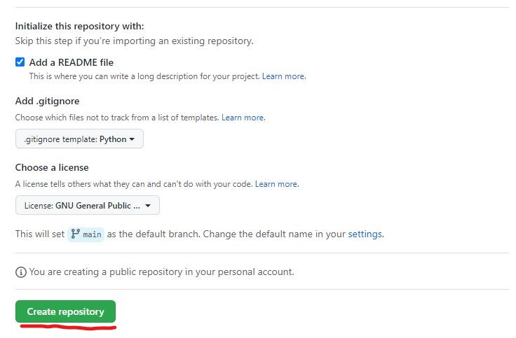
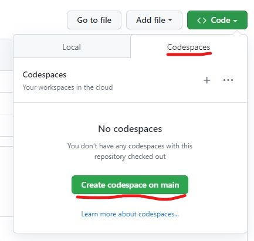
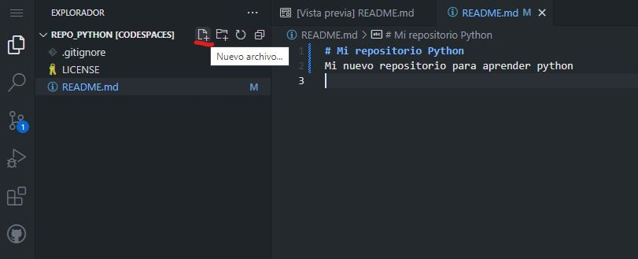
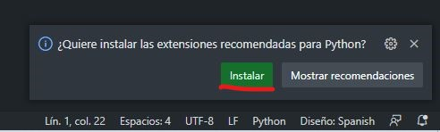
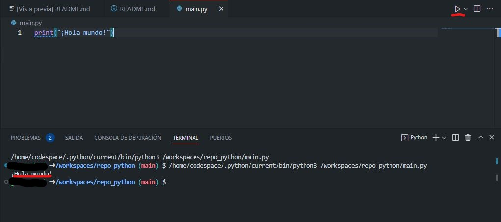
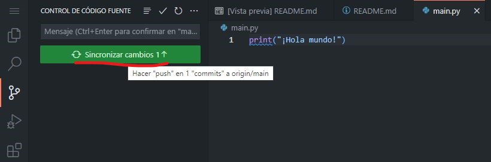
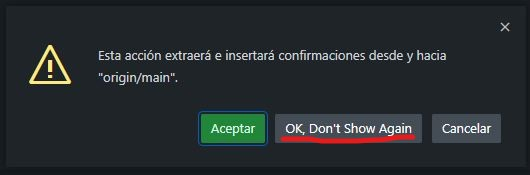
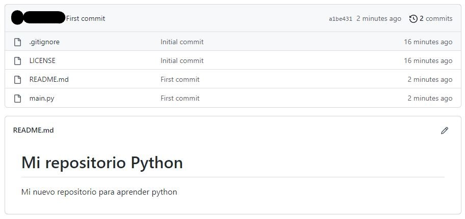

# Lección 02: Hola Mundo con Github y Codespaces

**[Índice](../README.md)**

**[Anterior](../01/01_Introduccion.md)**

## Pasos previos
Para continuar con esta lección, previamente deberías:
- Haber creado una cuenta (gratuita) de usuario en [Github](https://github.com).
- Haber iniciado sesión en [Github](https://github.com) con esa cuenta de usuario.

## Crear un repositorio en Github para desarrollar en Python

Un repositorio(repo) en Github es un espacio de almacenamiento en el que alojar el código fuente de un proyecto y otros archivos importantes para el proyecto. Tienes información completa sobre repositorios de Github [aquí](https://docs.github.com/es/repositories/creating-and-managing-repositories/about-repositories).

1. Para crear un nuevo repositorio pulsa el signo + en la parte superior derecha de la pantalla y selecciona "New repository".


2. Asigna un nombre a tu repositorio y opcionalmente una descripción. Marca la opción "Add a README file", elije un template de Python para añadir un archivo .gitignore y selecciona la licencia que prefieras para tu repositorio. Finalmente, pulsa "Create Repository".




Con estos sencillo pasos, habrás creado un nuevo repositorio. En la parte central se muestra la lista de archivos que contiene el repositorio inicialmente. En la parte inferior se muestra una previsualización del archivo README.md (markdown) y en la parte derecha se muestra información sobre el respositorio (puede editarse en cualquier momento.)


## Crear un Codespace con Python + Visual Studio Code para comezar a desarrollar

Con una cuenta gratuita de Github dispondrás de 60 horas al mes de Codespaces. Consulta información completa sobre Github Codespaces [aquí](https://docs.github.com/es/codespaces/overview).

3. Pulsa el botón "Code" (parte superior derecha de la vista del repositorio). Selecciona la pestaña "Codespaces" y pulsa el botón "Create codespace on main".



Pasados unos segundos, dispondrás de un entorno de desarrollo completo para Python 3 con Visual Studio Code. Puedes cambiar los colores (el tema) de Visual Studio Code, para tener el fondo negro y texto coloreado.

4. (Opcional) Pulsa la rueda dentada (botón ajustes) de la parte inferior izquierda de la ventana. Selecciona "Tema de color" y elije el tema que más te guste. En mi caso, "Github Dark".


5. En la parte izquierda de la pantalla de Visual Studio Code se muestra la lista de archivos del repositorio. Haz doble click sobre README.md y modifícalo según se muestra en la siguiente imágen. Sobre el botón de control de versiones de la parte izquierda aparecerá una bolita azul con el número 1 (significa que hay cambios en un archivo, el que acabas de modificar).


## Hola Mundo en Python

Los scripts o programas en Python se escriben en archivos de texto con extensión ".py".

6. En la parte izquierda de la pantalla, junto al nombre del repositorio, pulsa el botón "Nuevo archivo..." y crea un archivo llamado "main.py".



7. Completa el archivo "main.py" con el texto "print("¡Hola mundo!")", tal y cómo se muestra en la imágen.

```python
print("¡Hola mundo!")
```


Este programa es muy sencillo, únicamente escribe por pantalla/consola el mensaje "¡Hola Mundo!" cada vez que se ejecuta.

Visual Studio Code detectará que estás desarrollando en Python y te preguntará si quieres instalar la extensión de Python para Visual Studio Code. Es muy recomendable responder que sí.



8. Ejecuta el script pulsando el botón ▶ de la parte superior derecha de la pantalla. Visual Studio Code abrirá un terminal de Python en la parte inferior de la pantalla y ejecutará el script. Si no hay ningún problema, imprimirá el mensaje "¡Hola mundo!".



9. (Opcional) Prueba a cambiar el texto entre comillas ¡Hola mundo! por cualquier otro mensaje y ejecuta de nuevo el script.

```python
print("¿Qué miras?, Bobo")
```

## Sincronizar los cambios con el repositorio de Github

Consulta información básica sobre el control de versiones git y Github [aquí](https://docs.github.com/es/get-started/using-git/about-git).

Desde Visual Studio Code es posible trabajar con el control de versiones Git y mantener el respositorio sincronizado con Github. Para ello, es necesario ir a la pestaña de control de versiones.

10. En los botones de la izquierda, pulsa en de control de versiones (marcado en rojo en la siguiente imágen).


En el panel de la izquierda se pueden comprobar qué archivos tienen cambios, en este caso dos archivos.

11. Confirma los cambios que quieres hacer en el repositorio, en este caso los cambios en todos los archivos. Pulsa el + que se marca en rojo en la siguiente imágen. (También podrías confirmar los cambios de forma individual en cada archivo, pulsando el botón + en cada uno de ellos.)


12. Haz "commit" en el respositorio en local (dónde estés trabajando con VSCode, tu ordenador o un Codespace). Escribe un mensaje descriptivo en el cuadro de texto y pulsa el botón "Confirmación".


13. Sincroniza los cambios con el repositorio en Github pulsando el botón "Sincronizar cambios".



Aparecerá el siguiente mensaje que debes aceptar o marcar "Ok, Don't show again".



También puede aparecerte el siguiente mensaje para que el codespace se actualice regularmente con el repositorio. Pulsa igualmente "Sí".


Tras unos instantes, todos los cambios se habrán sincronizado con el repositorio en GitHub. Si visitas tu repositorio (es posible que tengas que refrescar el navegador) en Github, verás que todos los cambios se han aplicado.



## Cerrar el Codespace

Cuando acabes de desarrollar es necesario cerrar el codespace para que no permanezca activo. Mientras el codespace está desactivado no computarán las horas de uso. Recuerda que para una cuenta gratuita de Github el límite son 60h/mes gratis, a partir de la hora 60 tiene un coste. Cada mes se resetean las 60 horas gratuitas.

14. Para cerrar el codespace pulsa sobre "Codespaces" en la parte inferior izquierda de la ventana de Visual Studio Code, y pulsa "Stop Current Codespace" entre las opciones disponibles.


Para volver a trabajar con Visual Studio Code tendrás que volver a lanzar el Codespace. No hay limitación en cuanto al número de veces que puede pararse o lanzarse un Codespace.

## Rearrancar un Codespace

15. Desde Github, con la sesión iniciada pulsa "Codespaces" en la barra superior.


16. Pulsa sobre el nombre del codespace que quieres rearrancar y confirma pulsando el botón "Restart codespace".


En unos segundos volverás a tener Visual Studio Code listo para continuar trabajando.

**[Siguiente](../03/03_Lexico.md)**

