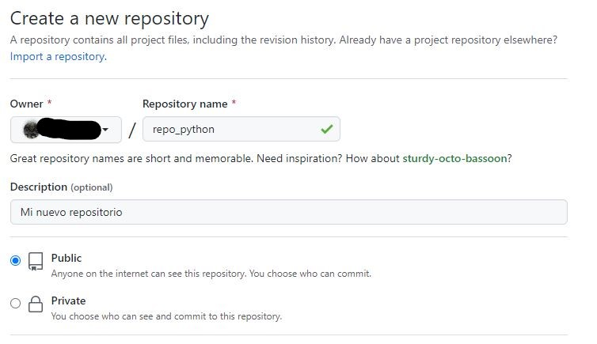

# Lección 02: Hola Mundo con Github y Codespaces

## Pasos previos
Para continuar con esta lección, previamente deberías:
- Haber creado una cuenta (gratuita) de usuario en [Github](https://github.com).
- Haber iniciado sesión en [Github](https://github.com) con esa cuenta de usuario.

## Crear un repositorio en Github para desarrollar en Python

Un repositorio(repo) en Github es un espacio de almacenamiento en el que alojar el código fuente de un proyecto y otros archivos importantes para el proyecto. Tienes información completa sobre repositorios de Github [aquí](https://docs.github.com/es/repositories/creating-and-managing-repositories/about-repositories).

1. Para crear un nuevo repositorio pulsa el signo + en la parte superior derecha de la pantalla y selecciona "New repository".

2. Asigna un nombre a tu repositorio y opcionalmente una descripción. Marca la opción "Add a README file", elije un template de Python para añadir un archivo .gitignore y selecciona la licencia que prefieras para tu repositorio. Finalmente, pulsa "Create Repository".

Con estos sencillo pasos, habrás creado un nuevo repositorio. En la parte central se muestra la lista de archivos que contiene el repositorio inicialmente. En la parte inferior se muestra una previsualización del archivo README.md (markdown) y en la parte derecha se muestra información sobre el respositorio (puede editarse en cualquier momento.)

## Crear un Codespace con Python + Visual Studio Code para comezar a desarrollar

Con una cuenta gratuita de Github dispondrás de 60 horas al mes de Codespaces. Consulta información completa sobre Github Codespaces [aquí](https://docs.github.com/es/codespaces/overview).

3. Pulsa el botón "Code" (parte superior derecha de la vista del repositorio). Selecciona la pestaña "Codespaces" y pulsa el botón "Create codespace on main".

Pasados unos segundos, dispondrás de un entorno de desarrollo completo para Python 3 con Visual Studio Code. Puedes cambiar los colores (el tema) de Visual Studio Code, para tener el fondo negro y texto coloreado.

4. (Opcional) Pulsa la rueda dentada (botón ajustes) de la parte inferior izquierda de la ventana. Selecciona "Tema de color" y elije el tema que más te guste. En mi caso, "Github Dark".

5. En la parte izquierda de la pantalla de Visual Studio Code se muestra la lista de archivos del repositorio. Haz doble click sobre README.md y modifícalo según se muestra en la siguiente imágen. Sobre el botón de control de versiones de la parte izquierda aparecerá una bolita azul con el número 1 (significa que hay cambios en un archivo, el que acabas de modificar).

## Hola Mundo en Python

Los scripts o programas en Python se escriben en archivos de texto con extensión ".py".

6. En la parte izquierda de la pantalla, junto al nombre del repositorio, pulsa el botón "Nuevo archivo..." y crea un archivo llamado "main.py".

7. Completa el archivo "main.py" con el texto "print("¡Hola mundo!")", tal y cómo se muestra en la imágen.

Este programa es muy sencillo, únicamente escribe por pantalla/consola el mensaje "¡Hola Mundo!" cada vez que se ejecuta.

Visual Studio Code detectará que estás desarrollando en Python y te preguntará si quieres instalar la extensión de Python para Visual Studio Code. Es muy recomendable responder que sí.

8. Ejecuta el script pulsando el botón ▶ de la parte superior derecha de la pantalla. Visual Studio Code abrirá un terminal de Python en la parte inferior de la pantalla y ejecutará el script. Si no hay ningún problema, imprimirá el mensaje "¡Hola mundo!".

9. (Opcional) Prueba a cambiar el texto entre comillas ¡Hola mundo! por cualquier otro mensaje y ejecuta de nuevo el script.

## Sincronizar los cambios con el repositorio de Github